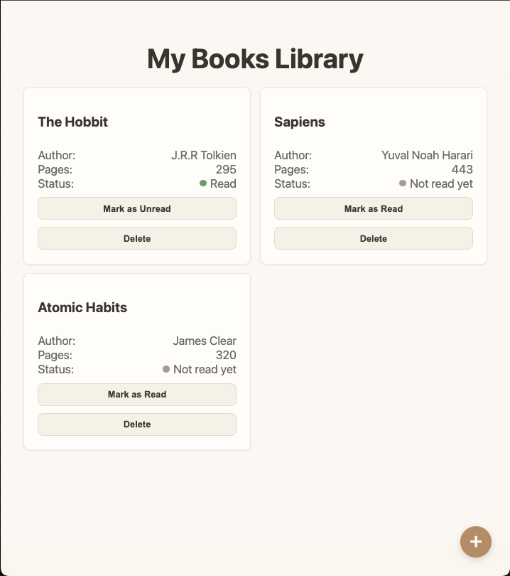

# 📚 Library

A small library app for tracking books you own — add books, mark them as read or unread, and remove them from your shelf. Built as a project for [The Odin Project](https://www.theodinproject.com/lessons/node-path-javascript-library) to practice constructors, prototypes, and DOM manipulation.

## 🔗 Live Demo

[View it live](https://malvin149.github.io/library/) 



## ✨ Features

- Add a new book via a modal dialog form (title, author, page count, read status)
- Mark any book as read / unread with a single click
- Remove a book from your library
- Each book is tracked by a unique ID (`crypto.randomUUID()`), so books can be added, removed, or reordered without ID collisions
- Fully responsive card grid layout

## 🛠️ Built With

- HTML5 (native `<dialog>` element for the add-book modal)
- CSS3 (Grid, Flexbox)
- Vanilla JavaScript (no frameworks or libraries)

## 🧠 What I Learned

This project was my first real dive into constructors and prototypes — understanding *why* shared methods belong on `Book.prototype` instead of being redefined per instance, and how the prototype chain actually resolves a method call. It also pushed me to properly separate application data (`myLibrary`, a plain array of `Book` objects) from the DOM display layer, so the UI is always just a reflection of the underlying data rather than a second source of truth. Along the way I got comfortable with event delegation — attaching a single listener to a parent container instead of rebinding listeners every time the list re-renders — and with the native `<dialog>` element for building an accessible modal without hand-rolling overlay and backdrop logic.

## 🚀 Getting Started

Clone the repo and open `index.html` in your browser — no build step or dependencies required.

```bash
git clone https://github.com/malvin149/library-project.git
cd library-project
open index.html
```